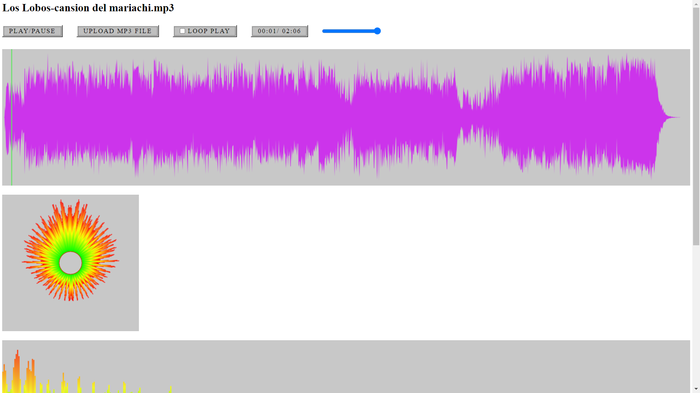
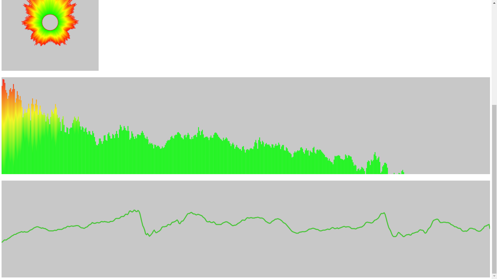

# introduction

The project is a visualizer of audio using the `Web Audio API`.

- [x] A wave graph that can be updated to show progress when clicked.
- [x] Frequency graph.
- [x] Oscilloscope graph.
- [x] Circle graph with dancing rays.




# Run

```
yarn
yarn dev
```

Please upload a file in `MP3` format.
